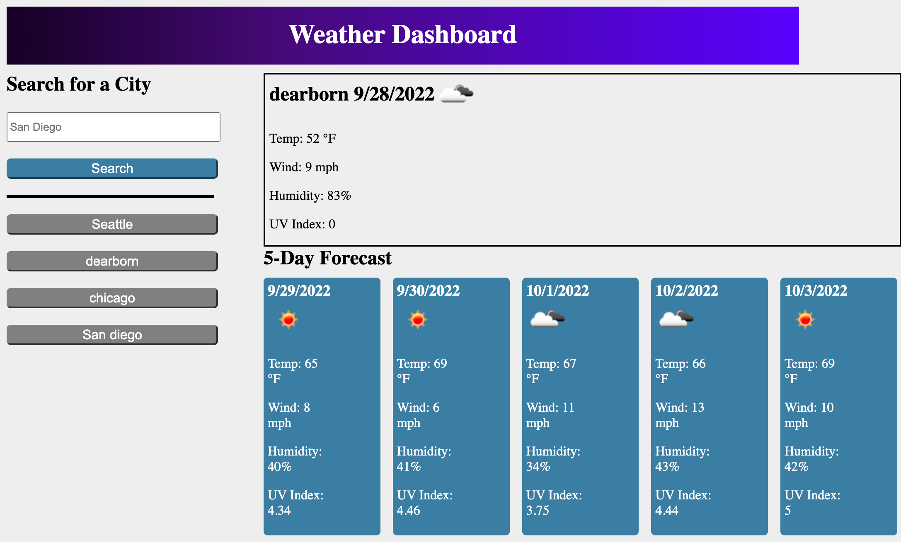

# cool-weather-dashboard
With the use of the OpenWeather One Call API, I was able to create a website that retrieves the weather data for cities. I built a weather dashboard that features dynamically updated HTML and CSS. The site provides five cards to display the forecast for the five upcoming days. The data will display the Temperature, Humidity, Wind Speed, and UV Index.

# Screenshot

# Links

GitHub Repo Link: https://github.com/bilalfarrukh2000/cool-weather-dashboard
Deployed URL: https://bilalfarrukh2000.github.io/cool-weather-dashboard/